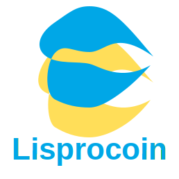

# LisproCoin App

Un'applicazione decentralizzata per la gestione di liquidità e trading di criptovalute, basata su LisproCoin.



## Caratteristiche

- **Scambio di token**: Scambia facilmente tra diverse criptovalute
- **Pools di liquidità**: Crea e gestisci pool di liquidità
- **Grafici di mercato**: Visualizza grafici dettagliati delle criptovalute
- **Portfolio**: Monitora i tuoi investimenti in un unico posto
- **Interfaccia intuitiva**: Design moderno e facile da usare

## Requisiti

- Node.js 14.x o superiore
- NPM 7.x o superiore o Yarn 1.22.x o superiore

## Installazione

```bash
# Clona il repository
git clone https://github.com/YourUsername/lisprocoin-app.git
cd lisprocoin-app

# Installa le dipendenze
npm install
# oppure
yarn install

# Avvia il server di sviluppo
npm run dev
# oppure
yarn dev
```

## Build per produzione

```bash
# Compila e minifica per la produzione
npm run build
# oppure
yarn build
```

## Contribuire

Siamo aperti ai contributi! Si prega di leggere il file CONTRIBUTING.md per le linee guida.

## Licenza

Questo progetto è sotto licenza MIT. Vedere il file LICENSE per i dettagli.

## Contattaci

- Sito Web: [lisprocoin.fi](https://lisprocoin.fi)
- Email: contact@lisprocoin.fi
- Twitter: [@LisproCoin](https://twitter.com/LisproCoin)
- Discord: [discord.lisprocoin.fi](https://discord.lisprocoin.fi)
